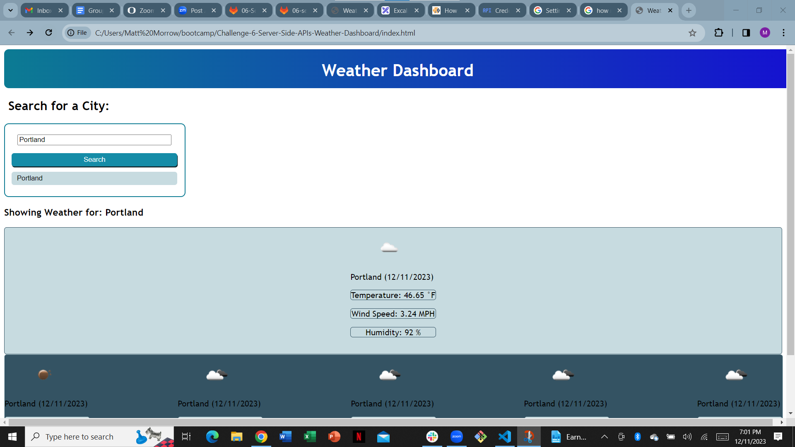
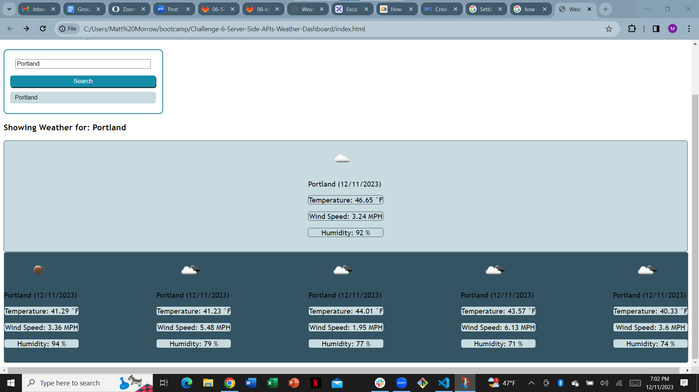
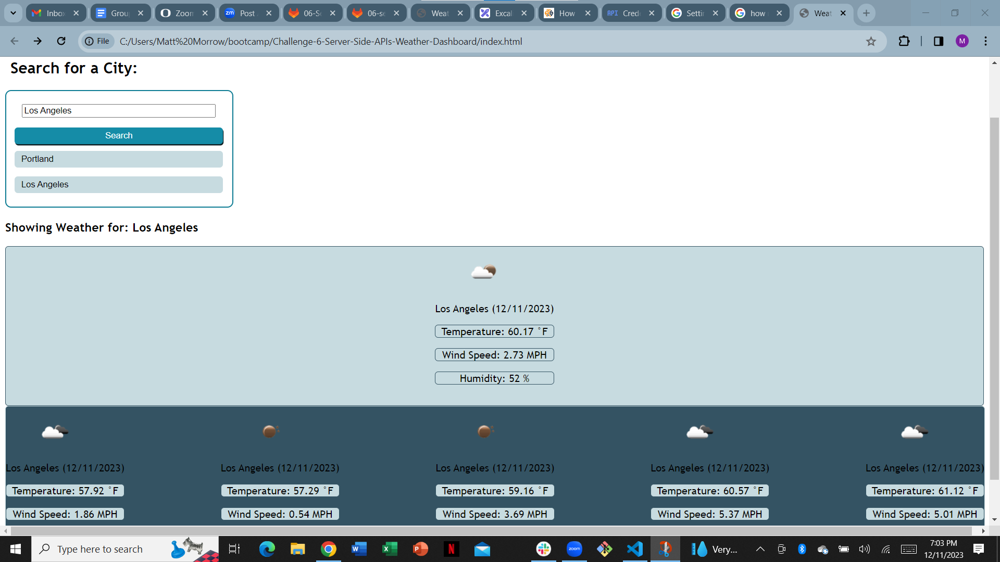

## Challenge 6: Weather Dashboard

## Details
A functional weather app that uses the OpenWeather API to pull realtime data and display current weather as well as a five-day forecast for the city defined in the search bar.

## Credits
Matt Morrow

## License

N/A

## Features
- functional search bar
- current weather & 5-day forecast
- saves to local storage

## Link to Live Application

https://mmorrow6109.github.io/Challenge-6-Server-Side-APIs-Weather-Dashboard/

## Screenshots

